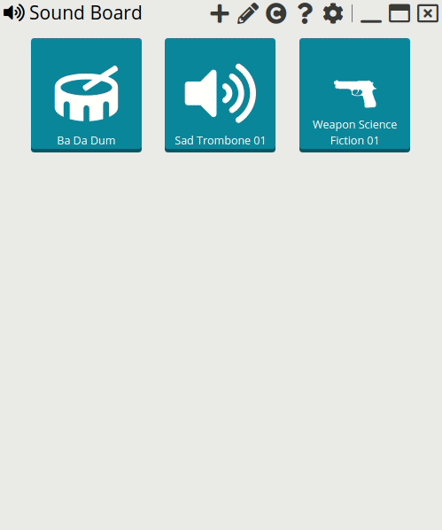

# Sound board

A colleague comes to you with a questionable request and you answer with a funny sound of your board!

## Download

> Note: Currently the program is not signed.
> Therefore, most antivirus programs will recognize the software as harmful.
> If that happens, you will need to whitelist the software.
>
> 

| Windows | Linux | Mac |
|:---:|:---:|:---:|
|  |  |  |
| |  | |
| |  | |
| |  | |

## Documentation

* [Using the App](docs/using-the-application.md)
* [Development](docs/development.md)
