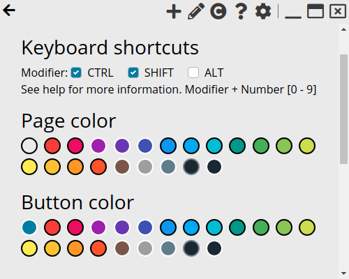
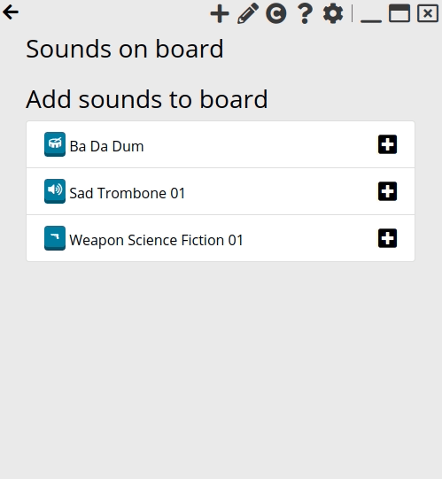
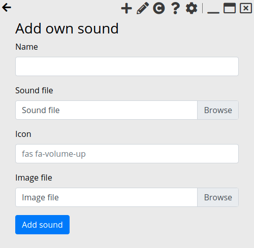

# Using the Application

## Keyboard shortcuts

You can control the first 10 sounds using keyboard shortcuts.

To do this, set the desired modifiers in the settings and then press the key combinations.

In the case of the picture that would be Ctrl + Shift + 1.

The order of the numbers is 1, 2, 3, 4, 5, 6, 7, 8, 9, 0.

The Num-Pad cannot be used at the moment.

## Edit board & Predefined sounds

In the Edit section to the board below, you can add predefined sounds.

At the top you can edit the board. There you can move or delete your sounds. If you delete your own sounds, you have to add them again.

## Add own sounds

You can theoretically choose as sounds or images any file format available on the web.
However, I have limited the selection to the standard file formats.
If a format is missing just create an issue or a pull request.

As `icon` you can use anything that exists from [Font Awesome](https://fontawesome.com/) free package.
